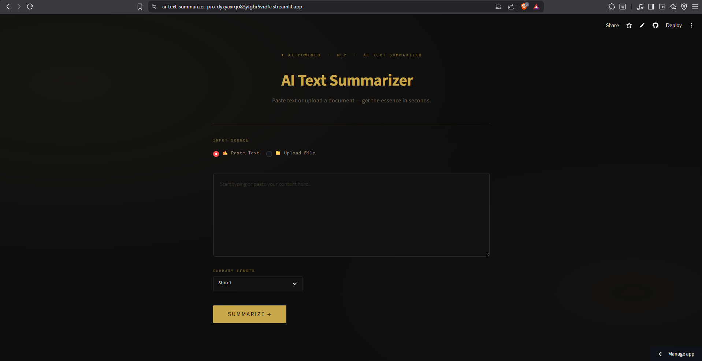

# 🧠 AI Text Summarizer Pro

AI‑powered text summarization app built with **Streamlit** and **HuggingFace Transformers**.  
Paste text or upload PDF/DOCX/TXT files and get a clear, concise summary — even for long documents!

🌐 **Live App:** https://ai-text-summarizer-pro-dyxyaxrqo83yfgbr5vrdfa.streamlit.app/

---

## 🚀 Features

- ✍️ **Paste or Upload Files:** Accepts long text entered manually or uploaded as **PDF / DOCX / TXT**
- 📄 **Chunked Summarization:** Handles long text by splitting into chunks and summarizing each
- ⏳ **Progress Feedback:** Shows progress bar and status updates while summarizing
- 🎨 **Polished UI:** Custom dark theme, hero section, styled controls, and summary card
- ⬇️ **Download Summary:** Export your summary as a `.txt` file
- 📊 **Summary Length Options:** Short / Balanced / Detailed

---

## 🧪 Usage Examples & Demo

- Summarize an academic article
- Condense meeting transcripts
- Extract key points from long reports

### Demo Screenshot


---

## 🛠️ Installation

1. **Clone the repo**
   ```bash
   git clone https://github.com/NOTAaronjose/ai-text-summarizer-pro.git
   cd ai-text-summarizer-pro

## 📝 Assignment Guide

This project was built as part of the **Nasscom AI-Code Sarathi · Prompt-to-Production** workshop.  
Follow the steps below to replicate or understand the assignment workflow.

**Video Link:** [Workshop Video](https://drive.google.com/file/d/1CWpwNoDyYkQnVtBS19n2xW5bWi7-uRrS/view?usp=sharing)

### Contents
1. What You Need
2. Fork the Repository
3. Clone to Your Computer
4. Create Your Branch
5. How the Assignment Works
6. UC-0A — The Model (Done With Your Facilitator)
7. Choose Your Use Case
8. Step 1 — Read the UC README
9. Step 2 — Generate agents.md Using AI
10. Step 3 — Generate skills.md Using AI
11. Step 4 — Build and Run Your Code
12. Step 5 — Commit Your Work
13. Step 6 — Push to GitHub
14. Step 7 — Open a Pull Request
15. What Happens Next

*(Full detailed guide included in `docs/assignment_guide.md` for clarity.)*
